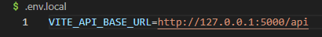

# NRL Tipping App Frontend 🏉
[Launched Website](https://nrltipping.vercel.app/)


A modern, responsive React frontend for an NRL (National Rugby League) tipping application that combines user betting with AI-powered match predictions. This application provides an engaging platform for users to place bets on NRL matches while showcasing advanced machine learning predictions and bankroll management.

## 🚀 Features

- **Interactive Match Betting**: Real-time match display with live odds and betting functionality


- **AI Dashboard**: Comprehensive analytics showing AI model performance and predictions

- **Bankroll Management**: Visual charts tracking user and AI bot performance over time

- **Leaderboard System**: Global rankings with user vs AI bot comparisons

- **Real-time Updates**: Live score updates via Server-Sent Events (SSE)
- **Responsive Design**: Optimized for desktop, tablet, and mobile devices

- **Google OAuth Integration**: Seamless authentication with Google accounts


## 🛠️ Technologies & Libraries

### Core Technologies
- **React 18** - Modern frontend framework with hooks
- **Vite** - Fast build tool and development server
- **JavaScript (ES6+)** - Primary programming language

### Key Libraries
- **React Router DOM** - Client-side routing and navigation
- **Chart.js & React-Chartjs-2** - Interactive bankroll performance charts
- **Axios** - HTTP client for API communication
- **CSS Modules** - Scoped styling for components

### Development Tools
- **ESLint** - Code linting and quality enforcement
- **Vercel** - Deployment and hosting platform


## 📁 Project Structure

```
nrl-tipping-app-frontend/
├── public/                     # Static assets
│   └── vite.svg
├── src/
│   ├── components/            # Reusable UI components
│   │   ├── AIPredictionDisplay.jsx    # AI prediction cards
│   │   ├── BankrollChart.jsx          # Performance charts
│   │   ├── MatchItem.jsx              # Individual match betting
│   │   ├── MatchList.jsx              # Match listings with SSE
│   │   ├── Navbar.jsx                 # Navigation component
│   │   └── LoginForm.jsx              # Authentication forms
│   ├── pages/                 # Route-level components
│   │   ├── DashboardPage.jsx          # User dashboard
│   │   ├── AIDashboardPage.jsx        # AI analytics dashboard
│   │   ├── LeaderboardPage.jsx        # Global rankings
│   │   ├── MyBetsPage.jsx             # User bet history
│   │   └── ResultsPage.jsx            # Match results
│   ├── contexts/              # React context providers
│   │   └── AuthContext.jsx            # Authentication state
│   ├── hooks/                 # Custom React hooks
│   ├── services/              # API communication
│   │   └── api.js                     # Axios configuration
│   ├── assets/                # Images and static files
│   │   └── logoMap.js                 # Team logo mappings
│   ├── utils/                 # Utility functions
│   ├── App.jsx                # Main application component
│   ├── main.jsx              # Application entry point
│   └── index.css             # Global styles
├── package.json              # Dependencies and scripts
├── vite.config.js           # Vite configuration
└── vercel.json              # Deployment configuration
```

## Installation Instructions

### Prerequisites
- **Node.js** (v16 or higher)
- **npm** or **yarn**
- Access to the [NRL Tipping Backend](https://github.com/JakeHarevyy/nrl-tipping-app-backend)

### Step 1: Clone the Repository
```bash
git clone https://github.com/JakeHarveyy/nrl-tipping-app-frontend.git
cd nrl-tipping-app-frontend
```

### Step 2: Install Dependencies
```bash
npm install
# or
yarn install
```

### Step 3: Environment Configuration
Create a `.env.local` file in the root directory:
```env
VITE_API_BASE_URL=http://localhost:8000
VITE_GOOGLE_CLIENT_ID=your_google_oauth_client_id
```


### Step 4: Start Development Server
```bash
npm run dev
# or
yarn dev
```

The application will be available at `http://localhost:5173`

### Step 5: Verify Backend Connection
Ensure the [NRL Tipping Backend](https://github.com/JakeHarveyy/nrl-tipping-app-backend) is running on the configured API URL.

## How to Use the Application

### For New Users

1. **Registration/Login**
   - Visit the homepage and click "Register" or "Login"
   - Use email/password or Google OAuth for authentication
   - New users receive a starting bankroll of $1,000

    

2. **Placing Bets**
   - Navigate to the Dashboard to see upcoming matches
   - Select a team and enter your bet amount
   - View potential payout before confirming
   - Monitor your bets in the "My Bets" section

   

3. **Tracking Performance**
   - View your bankroll history in interactive charts
   - Compare your performance against the AI bot
   - Check your ranking on the global leaderboard

   
   

### Understanding AI Predictions

1. **AI Dashboard Access**
   - Click "AI Dashboard" in the navigation
   - No login required - publicly accessible
   - Explore different tabs: Model Info, Overview, Predictions, Bets

    

    

    

    

    

2. **Reading AI Predictions**
   - **Confidence Levels**: High (85%+), Medium (65-84%), Low (50-64%)
   - **Betting Recommendations**: Based on Kelly Criterion
   - **Value Detection**: When AI odds differ from market odds
    
    

3. **Performance Metrics**
   - View AI prediction accuracy over time
   - See AI bankroll performance vs human users
   - Understand the model's strengths and limitations

### Weekly Bankroll System
- Every user receives $1,000 added weekly
- Bankroll carries over between weeks
- Track long-term performance trends


## 🤝 Contributing Guidelines

We welcome contributions to improve the NRL Tipping App Frontend! Please follow these steps:

### 1. Fork the Repository
```bash
# Click the "Fork" button on GitHub
# Clone your fork locally
git clone https://github.com/JakeHarveyy/nrl-tipping-app-frontend.git
```

### 2. Create a Feature Branch
```bash
git checkout -b feature/your-feature-name
# Examples:
# git checkout -b feature/mobile-responsive-design
# git checkout -b feature/dark-mode-toggle
# git checkout -b fix/betting-form-validation
```

### 3. Make Your Changes
- Follow the existing code style and patterns
- Add CSS modules for new components
- Update or add comments where necessary
- Test your changes locally

### 4. Commit Your Changes
```bash
git add .
git commit -m "Add descriptive commit message"
# Examples:
# git commit -m "Add mobile responsive design for match cards"
# git commit -m "Fix betting form validation errors"
# git commit -m "Improve AI dashboard loading performance"
```

### 5. Push to Your Branch
```bash
git push origin feature/your-feature-name
```

### 6. Open a Pull Request
- Go to the original repository on GitHub
- Click "New Pull Request"
- Provide a clear description of your changes
- Include screenshots for UI changes
- Reference any related issues

### Development Guidelines
- **Components**: Use functional components with hooks
- **Styling**: Prefer CSS Modules over global styles
- **API Calls**: Use the existing `api` service
- **State Management**: Use React Context for global state
- **Responsive Design**: Test on mobile, tablet, and desktop

##  Contact Details

For questions, suggestions, or collaboration opportunities:
- **Email**: harvey.jake.roy@gmail.com
- **LinkedIn**: [Jake Harvey](https://www.linkedin.com/in/jake-harvey-b72016341/)
- **Project Maintainer**: Jake Harvey

## 🙏 Acknowledgements

### Related Repositories
- **[NRL Tipping Backend](https://github.com/JakeHarveyy/nrl-tipping-app-backend)** - The API server and database management
- **[LogisticsRegression-NRLPredictor](https://github.com/JakeHarveyy/LogisticsRegression-NRLPredictor)** - The machine learning model for match predictions

### Technologies & Libraries
- **React Team** - For the incredible React framework
- **Chart.js Contributors** - For powerful charting capabilities
- **Vite Team** - For the lightning-fast build tool
- **Vercel** - For seamless deployment and hosting

### Data Sources
- **NRL Official** - Match schedules and results
- **Pinnacle Sports** - Betting odds data
- **Various Sports APIs** - Team statistics and performance data

### Special Thanks
- Beta testers and early users for valuable feedback
- Open source community for inspiration and best practices
- NRL community for passion and engagement

---

## 📄 License

This project is licensed under the MIT License - see the LICENSE file for details.
---

**Ready to start tipping? Clone the repo and join the community of NRL prediction enthusiasts! 🏉🚀**
